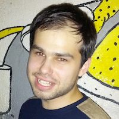
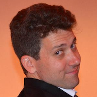
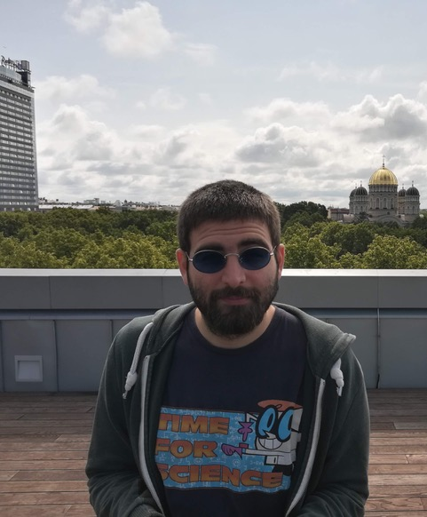
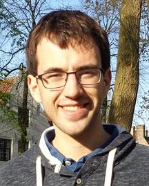
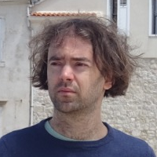
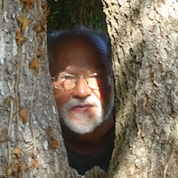
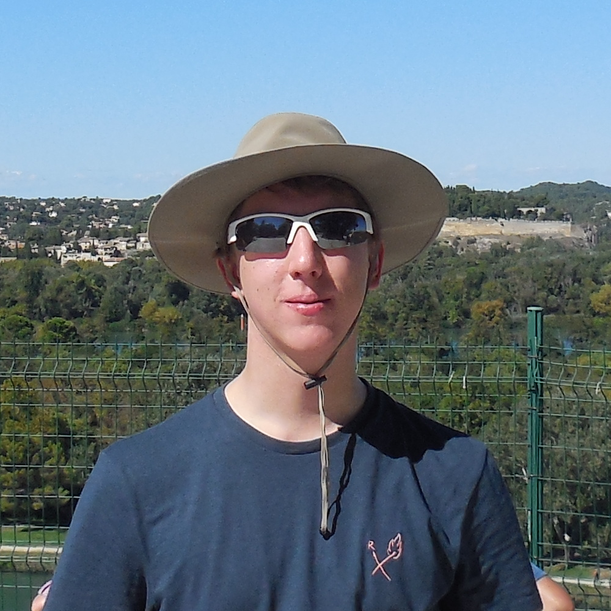

### [Wiesław Kubiś](https://users.math.cas.cz/~kubis/)

*principal investigator*

email: `kubis@math.cas.cz`

research interest: applications of logic and set theory; universal homogeneous objects in the context of category theory

### Adam Bartoš

*postdoc*

email: `bartos@math.cas.cz`

research interest: Fraïssé theory, general topology, category theory 

 

### [Tristan Bice](https://sites.google.com/site/tristanbice/)

*researcher*

email: `bice@math.cas.cz`

research interest: 
topology and lattice theory: Stone duality and frame/locale theory;
operator algebras and Étale groupoids: groupoid C\*-algebras, Steinberg algebras and Weyl groupoids;
semigroup theory: inverse semigroups, \*-semigroups and ordered groupoids;
logic: set theory and model theory

### [Ivan Di Liberti](https://diliberti.github.io)
*postdoc*

email: `diliberti.math@gmail.com`

research interest: categorical logic and foundations

### Arnaud Duvieusart
*postdoc*

email: `duvieusart@math.cas.cz`

research interest: ???

 

### Michal Doucha
*researcher*

email: `doucha@math.cas.cz`

research interest: topological and geometric group theory, descriptive set theory, functional analysis

 

### [Mirna Dzamonja](https://www.logiqueconsult.eu)

*researcher*

email: `logiqueconsult@gmail.com`

research interest: 
Logic in all its aspects : mathematical, philosophical and in computer sciences

 

### [Vladimir Müller](http://www.math.cas.cz/homepage/main_page.php?id_membre=21)
*researcher*

email: `muller@math.cas.cz`

research interest: operator theory

 

### Ziemowit Kostana
*PhD student - University of Warsaw doctoral programme*

email: `kostana@math.cas.cz`

research interest: set theory and its applications to other parts of mathematics, mainly model theory and topology

