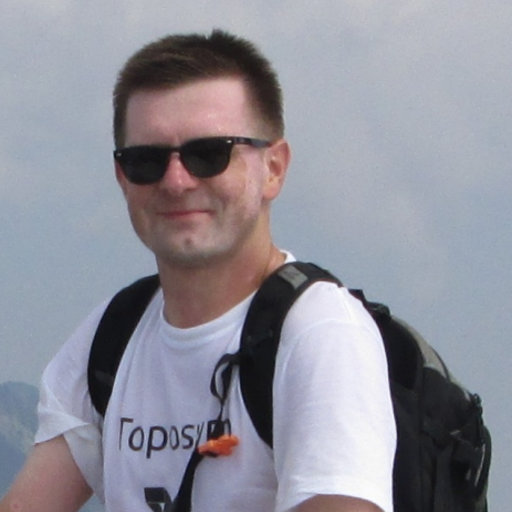
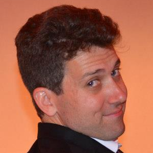
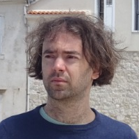
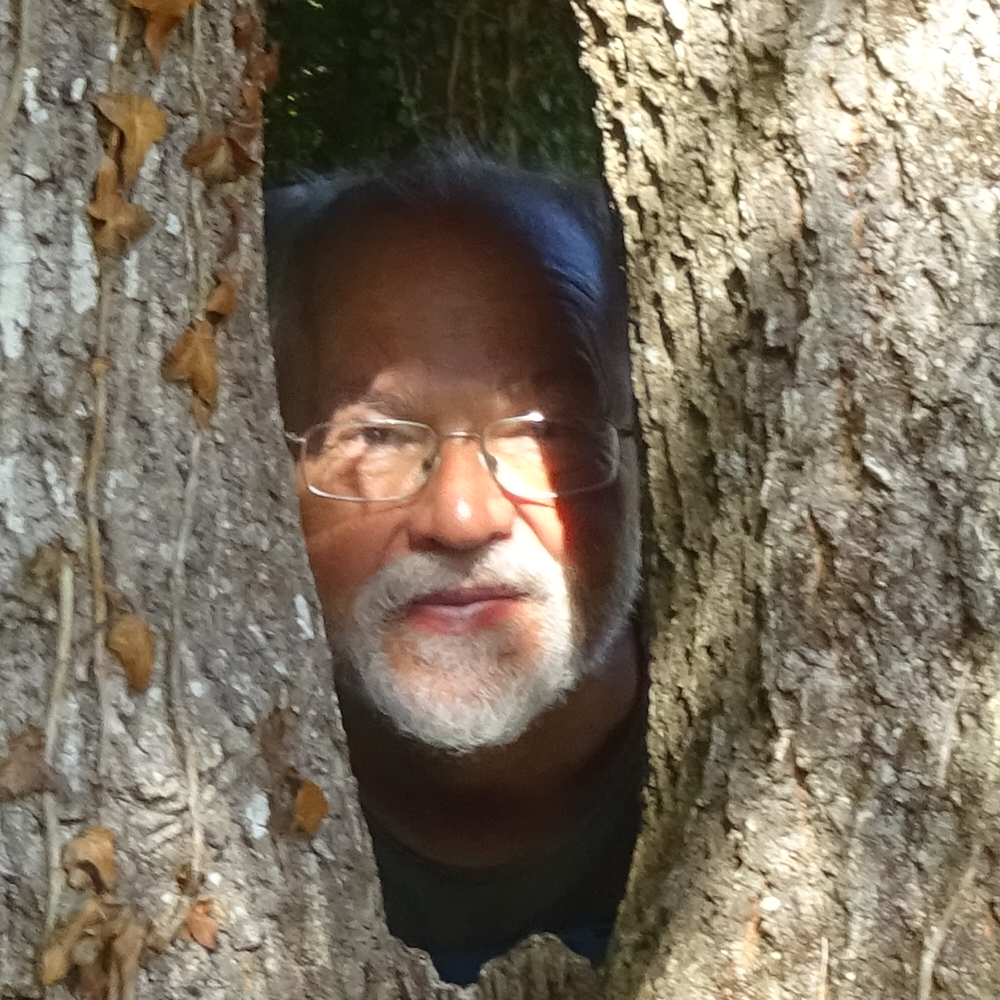
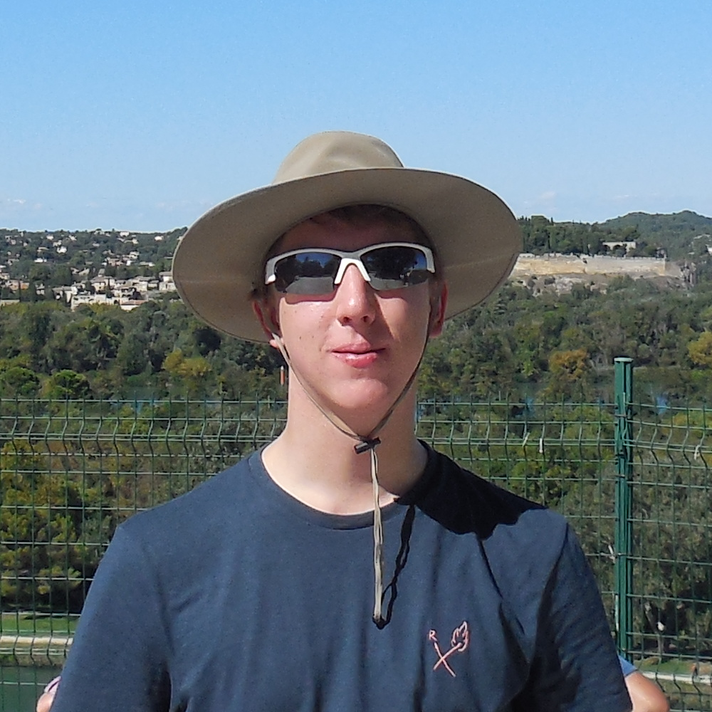

### Wiesław Kubiś

*principal investigator*

email: `kubis@math.cas.cz`

research interest: ...?

### Tristan Bice

*researcher*

email: `bice@math.cas.cz`

research interest: 

### Michal Doucha
*researcher*

email: `doucha@math.cas.cz`

research interest: topological and geometric group theory, descriptive set theory, functional analysis

### Vladimir Müller
*researcher*

email: `muller@math.cas.cz`

research interest: operator theory

### Ziemowit Kostana
*PhD student - University of Warsaw doctoral programme*

email: `kostana@math.cas.cz`

research interest: set theory and its applications to other parts of mathematics, mainly model theory and topology

